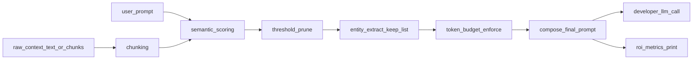

## Goals (viral DX)

- Ship a **pip-installable** library with a **3-line wrapper** around existing LLM calls.
- Reduce prompt tokens via **semantic pruning + budgeting** while preserving **must-keep entities**.
- Print **ROI telemetry** locally: before/after tokens + estimated cost savings.

## Repo scaffolding (empty folder)

- Create Python package layout in `[D:/artiMIND/ContextBuddy](D:/artiMIND/ContextBuddy)`:
  - `[pyproject.toml](D:/artiMIND/ContextBuddy/pyproject.toml)` (packaging + deps)
  - `[README.md](D:/artiMIND/ContextBuddy/README.md)` (landing page)
  - `[src/contextbuddy/](D:/artiMIND/ContextBuddy/src/contextbuddy/)` (library)
  - `[tests/](D:/artiMIND/ContextBuddy/tests/)` (core unit tests)
  - `[examples/](D:/artiMIND/ContextBuddy/examples/)` (copy/paste demos)
  - `[LICENSE](D:/artiMIND/ContextBuddy/LICENSE)` + `[.gitignore](D:/artiMIND/ContextBuddy/.gitignore)`

## Public API (3-line integration)

- Provide a single entrypoint that developers wrap around their existing SDK call:
  - `engine = ContextEngine(...)`
  - `result = engine.run(user_prompt=..., context=..., llm_call=lambda prompt: client.responses.create(...))`
- Also provide an optional convenience wrapper for common patterns:
  - `wrap_openai(client).responses.create(...)`-style adapter later (not MVP unless trivial).

## Core pipeline (MVP)

### 1) Chunking

- Accept `context` as either:
  - **string** (auto-split into paragraphs / headings)
  - **list[str]** (developer-provided chunks)
- Deterministic splitting so outputs are stable and screenshot-friendly.

### 2) Semantic pruning (cheap + fast)

- Embed **user_prompt** and each chunk using a low-cost embedding model (provider-agnostic interface).
- Score with cosine similarity and drop chunks under `min_relevance`.
- Cache embeddings in-memory for a single run; optional file cache later.

### 3) Entity extraction + “never drop” guardrail

- Extract entities from:
  - user_prompt
  - high-scoring chunks
- Build a **keep list** (IDs, dates, names, emails, URLs, ticket numbers) and:
  - ensure chunks containing keep-list entities survive pruning
  - inject a compact `KeyEntities:` section into the composed prompt
- MVP implementation: hybrid regex patterns + lightweight NER option behind a flag.

### 4) Token budgeting

- Developer sets `max_context_tokens` (e.g. 4000).
- Estimate tokens using a tokenizer backend:
  - preferred: `tiktoken` (OpenAI-compatible)
  - fallback: heuristic estimator if tokenizer unavailable
- If over budget:
  - drop lowest-score chunks first
  - then compress remaining tail via **extractive summary** (MVP) and add abstractive summarization hook later.

### 5) ROI telemetry (viral screenshots)

- Print in dev mode:
  - original token estimate
  - final token estimate
  - % reduction
  - estimated $ savings using a configurable price table
- Also expose a programmatic `engine.last_report` object for tests and dashboards.

## Provider-agnostic design

- Define small interfaces:
  - `Embedder`: `embed(texts)->vectors`
  - `Tokenizer`: `count_tokens(text)->int`
  - `CostModel`: `estimate_cost(tokens_in, tokens_out)->$`
- Ship a default “batteries-included” path that works out-of-the-box for Python users, but keep the core independent of any single LLM.

## Deliverables for launch

- `[README.md](D:/artiMIND/ContextBuddy/README.md)` structure:
  - hero section with one-liner value prop
  - **GIF** showing before/after + ROI print
  - 3-line quickstart snippet
  - “Works with OpenAI/Gemini/Anthropic/local” claim backed by the generic wrapper
  - FAQ: accuracy tradeoffs, privacy, caching, deterministic behavior
- `examples/`:
  - `openai_raw.py` (works as soon as user has OPENAI_API_KEY)
  - `gemini_raw.py` (optional)
- Initial tests:
  - pruning drops low relevance
  - keep-list prevents dropping entity-containing chunks
  - budgeting enforces max tokens

## Launch checklist (repo blow-up mechanics)

- Add GitHub topics + crisp tagline in repo description.
- Release v0.1.0 with a clear changelog.
- Draft “Show HN” post and a short Twitter/X thread template focused on ROI screenshots.

